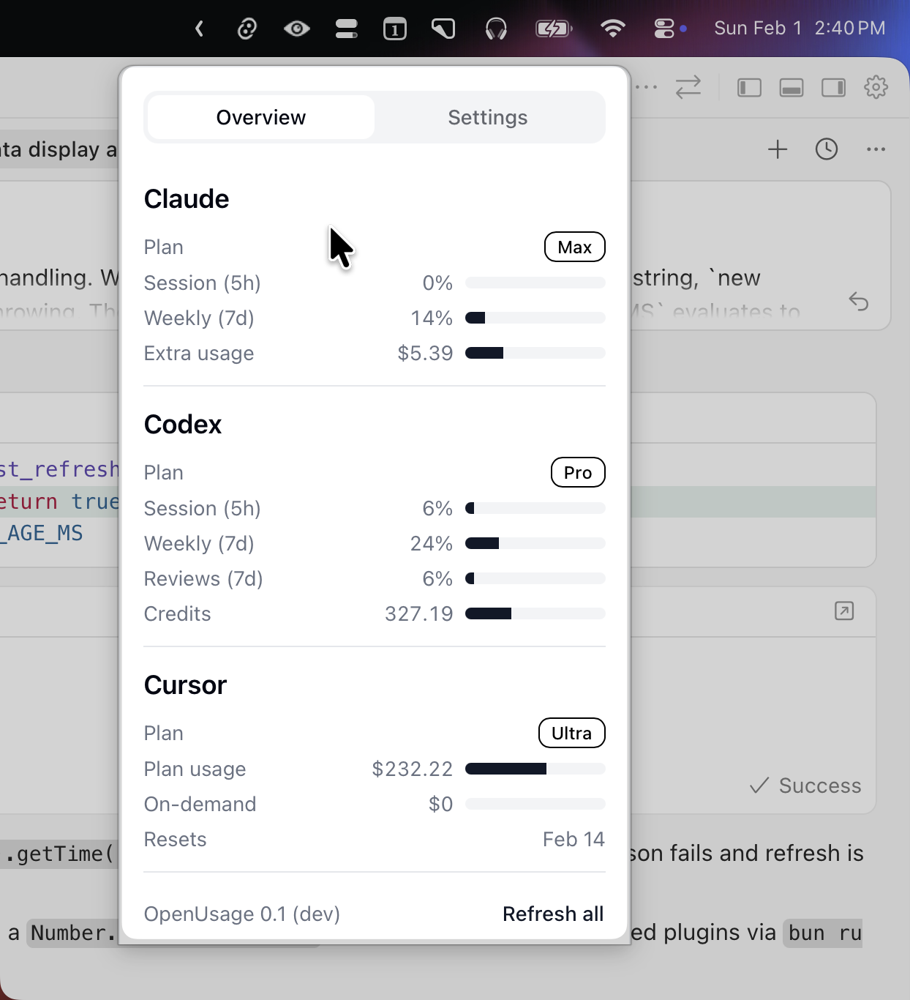

# OpenUsage

A re-imagined menu bar app for tracking AI coding tool subscriptions like Cursor, Claude, Codex and more, all in one place with a heavy focus on UX, stability, and speed.

Inspired by [CodexBar](https://github.com/steipete/CodexBar) by [@steipete](https://github.com/steipete).

Same idea, but a very different approach:

- **Fast** — Kept minimal to load fast
- **User Experience** — Extremely simple by design
- **Plugin architecture** — add/update providers without waiting on maintainers
- **Cross-platform** — Tauri instead of native Swift
- **Web tech** — React + TypeScript frontend



## How It Works

Each provider (Cursor, Claude, etc.) is a JavaScript plugin running in a QuickJS runtime. Plugins define a `probe()` function that fetches usage data via HTTP, local files, or SQLite databases and returns structured metrics (text, progress bars, badges).

The app calls all plugins on launch and when you hit Refresh — no background polling.

See [Plugin API](docs/openusage-api.md) for the full spec.

## Status

Early development. But somewhat works.

## Stack

- Tauri 2 + Rust
- React 19, Tailwind 4, Base UI
- Vite 7, bun

## Install

### From Source

```bash
git clone https://github.com/robinebers/openusage
cd openusage
bun install
bun tauri build
```

Built app lands in `src-tauri/target/release/bundle/`.

### Development

```bash
bun install
bun tauri dev
```

## Providers

Current:
- [Cursor](docs/providers/cursor.md) — plan, usage, on-demand
- [Claude](docs/providers/claude.md) — session, weekly, extra usage
- [Codex](docs/providers/codex.md) — session, weekly, code reviews, extra usage

Soon:
- [Gemini](https://github.com/robinebers/openusage/issues/13)/[Antigravity](https://github.com/robinebers/openusage/issues/14)
- [Factory/Droid](https://github.com/robinebers/openusage/issues/16)
- [Copilot](https://github.com/robinebers/openusage/issues/22)
- [Windsurf](https://github.com/robinebers/openusage/issues/15) (?)
- [Vercel AI Gateway](https://github.com/robinebers/openusage/issues/18) (?)

Adding a provider = adding a plugin. See [Plugin API](docs/openusage-api.md).

## Contributing

PRs welcome. Keep it simple:

- No feature creep
- No AI-generated commit messages
- Test your changes
- Provide before/after screenshots

## License

MIT

## Credits

[@steipete](https://github.com/steipete) for CodexBar and all the people that contributed to it.

Codex/Claude Code/Cursor for enabling me to do this on a weekend.