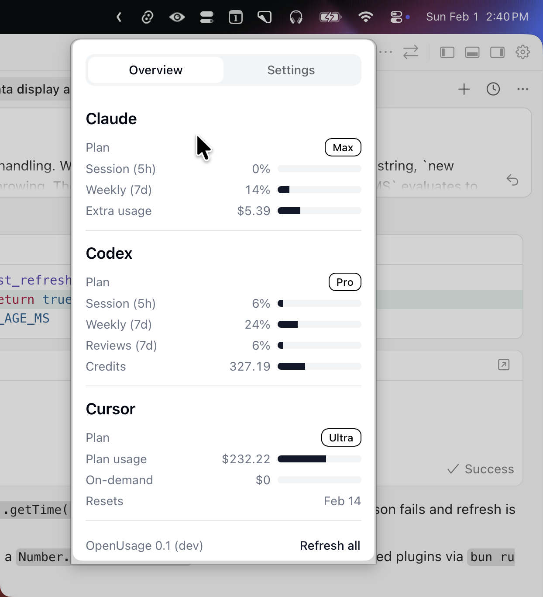

# OpenUsage Linux Fork

> Note: This is a fork of [Original Repo](https://github.com/robinebers/openusage). This version is modified and optimized specifically for Linux environments.

Track AI coding subscription usage from a Linux tray or desktop panel with one local desktop app.



## Overview

This fork keeps the OpenUsage plugin model and usage dashboard idea, but is maintained with a Linux-first focus:

- Linux-oriented release pipeline and packaging
- Ubuntu-friendly build dependencies and CI
- Linux runtime behavior fixes
- Linux auth compatibility fixes for CLI-backed providers

The project is aimed at people who want one place to check usage across multiple AI coding tools without manually opening each provider app or CLI.

## Status

- Primary target: Linux desktops
- Release artifact: `.deb`
- Current CI/CD publishing target: `x86_64-unknown-linux-gnu`
- Source builds on other platforms may still work, but this fork is maintained for Linux first

## Supported Providers

- [Amp](docs/providers/amp.md)
- [Antigravity](docs/providers/antigravity.md)
- [Claude](docs/providers/claude.md)
- [Codex](docs/providers/codex.md)
- [Copilot](docs/providers/copilot.md)
- [Cursor](docs/providers/cursor.md)
- [Factory / Droid](docs/providers/factory.md)
- [Gemini](docs/providers/gemini.md)
- [Kimi Code](docs/providers/kimi.md)
- [Perplexity](docs/providers/perplexity.md)
- [Windsurf](docs/providers/windsurf.md)
- [Z.ai](docs/providers/zai.md)

## Install

Download the latest Linux build from this fork:

[Download latest Linux release](https://github.com/hello112334/openusage/releases/latest)

The current release workflow is set up for Debian-style Linux packages. On Ubuntu or Debian:

```bash
sudo apt install ./openusage_*.deb
```

If your distro is not Debian-based, build from source instead.

## Build From Source

### Requirements

- Linux desktop environment
- Node.js 20+
- npm
- Rust stable toolchain
- Bun for the release wrapper script

Install Linux system packages:

```bash
sudo apt-get update
sudo apt-get install -y \
  libwebkit2gtk-4.1-dev \
  libayatana-appindicator3-dev \
  librsvg2-dev \
  patchelf
```

### Development

```bash
npm install
npm run tauri -- dev
```

### Release Build

```bash
bun install
bun run build:release -- --target x86_64-unknown-linux-gnu --bundles deb
```

If you need signed updater artifacts, create a `.env` based on [`.env.example`](.env.example) before running the release build.

### Version Bump, Tag, and Push

```bash
./scripts/bump-version.sh
./scripts/bump-version.sh 1.2.3
./scripts/bump-version.sh v1.2.3
```

Behavior:

- no argument: bumps the patch version from the latest `v*` git tag
- with an argument: uses that exact version
- syncs `package.json`, `src-tauri/tauri.conf.json`, and `src-tauri/Cargo.toml`
- creates `version/vX.Y.Z.md`
- commits the release, creates the tag, and pushes the branch plus tag to `origin`

The script requires a clean git working tree before it runs.

## Repository Layout

- [`docs/providers`](docs/providers) provider-specific auth and usage notes
- [`docs/plugins/api.md`](docs/plugins/api.md) plugin runtime API
- [`plugins`](plugins) bundled provider plugins
- [`src`](src) React frontend
- [`src-tauri`](src-tauri) Tauri and Rust desktop runtime

## Contributing

Linux-focused fixes, provider plugins, auth compatibility fixes, packaging improvements, and desktop behavior fixes are all in scope for this fork.

- Provider docs: [docs/providers](docs/providers)
- Plugin API: [docs/plugins/api.md](docs/plugins/api.md)
- Contribution guide: [CONTRIBUTING.md](CONTRIBUTING.md)
- Security policy: [SECURITY.md](SECURITY.md)

Issues and PRs for this fork should go to this repository:

[hello112334/openusage issues](https://github.com/hello112334/openusage/issues)

## Upstream

Upstream project:

- [robinebers/openusage](https://github.com/robinebers/openusage)

This fork exists to keep a Linux-optimized variant moving faster for Linux users and Linux-specific fixes.

## License

[MIT](LICENSE)
